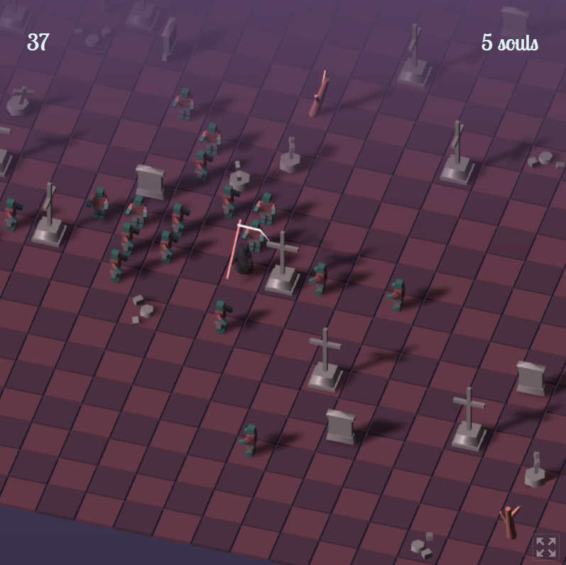

# Minimalism Jam - The Graveyard Reaper
Adopted from my Ludum Dare 48 Compo entry - [Deep in the Graveyard](https://ldjam.com/events/ludum-dare/48/deep-in-the-graveyard), which already fits the minimalism theme well. Keeping zombie as the only enemy type on a static map to be more minimalist.

## Intro
You, as the reaper, are reaping the souls of the undead in a graveyard. How many souls can you claim before your eternal rest?

## Instructions

- Game is turn based. All zombies move after you have taken an action.
- W/A/S/D or arrow key or click to move. Bump into an enemy to kill it
- Hit space or click on the reaper to skip a turn.
- Zombie moves 1 square horizontally or vertically per turn, and takes a turn to turn around

## Tools
- Written in Typescript. three.js for 3D rendering.
- All 3D models are procedurally created using three.js primitives.
- [Zughy 32](https://lospec.com/palette-list/zughy-32) palette.
- Sound effects generated by jsfxr. CC0 [Dark forest](https://www.chosic.com/download-audio/?t=27010&tag=Horror) background music from chosic.com.
- [Lobster Two](https://fonts.google.com/specimen/Lobster+Two) font from Google Fonts.

## Screenshots

